# 20250124_chiangrai

<html>
<head>

<meta charset="UTF-8">
<meta http-equiv="Content-Type" content="text/html; charset=UTF-8">
<meta http-equiv="X-UA-Compatible" content="IE=EmulateIE10" />
<meta http-equiv="X-UA-Compatible" content="IE=edge">

<!--ここから上はお決まりの定型文です-->

<!--ここからが表現の書式などを決めるcssという部分-->

<link href="https://cdnjs.cloudflare.com/ajax/libs/lightbox2/2.7.1/css/lightbox.css" rel="stylesheet">

</head>

<body>

モバイル端末をお使いの場合は、画面を横向きにすると
より見やすくご覧頂けます。

<!--ここ上は、ほぼそのまま使います！-->

<!--QRコードの挿入例-->

 アクセス用QRコード

<marquee direction="left" scrollamount="20" width="30%">(^_^)/~alis</marquee>

<!--流れ文字の挿入例-->
<h1><marquee behavior="left">!!! 2025/01/24、先日亡くなった故人の散骨から夕焼けグラデーションまで!!!</marquee></h1>

                          

<!--ここから下が、本体部分-->

<h2>いつもより遅い時間での撮影で、細い月が見えにくくなりました 24日 朝7:40</h2>
<a href="20250124_001.JPG" target="_blank">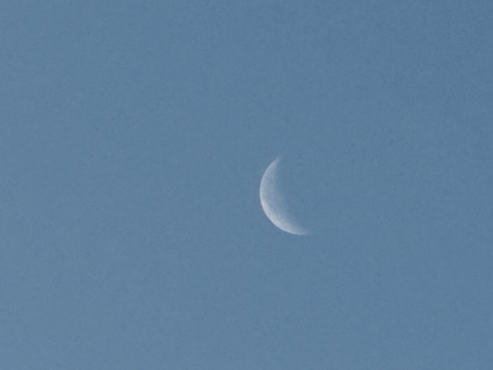</a>

<h2>すでに朝焼けも終わっていて、お月様も探すのが大変</h2>

<h2>先日亡くなった日本人男性をダビに付します 生前のお元気な笑顔から</h2>

<a href="yokota_003.JPG" target="_blank">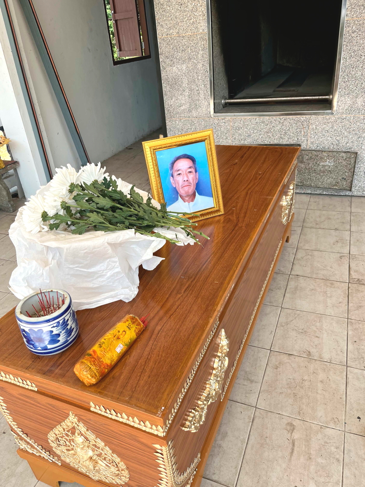</a>

<a href="yokota_006.JPG" target="_blank">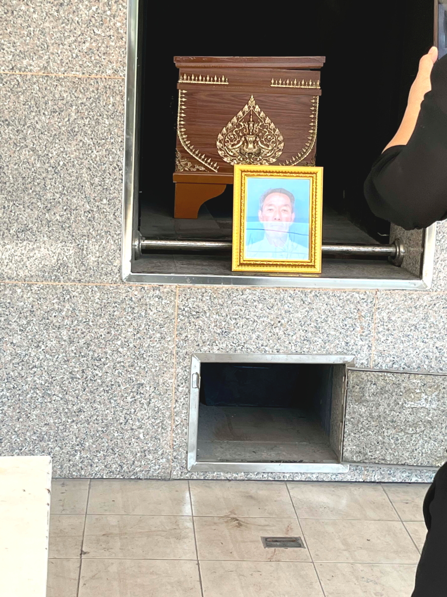</a>

<h2>ご本人の希望通り、メコン川に散骨しました</h2>

<h2>散骨の場所はこちら</h2>
<iframe src="https://www.google.com/maps/embed?pb=!4v1737725317089!6m8!1m7!1sua91AI6XqYuc_h6zNiZ6QA!2m2!1d20.27418900112421!2d100.0880265522161!3f64.73753692811357!4f3.9349586245716637!5f0.9119108722111607" width="600" height="450" style="border:0;" allowfullscreen="" loading="lazy" referrerpolicy="no-referrer-when-downgrade"></iframe> 

<h2>故人へのお花をたむけます</h2>
<a href="20250124_003.JPG" target="_blank">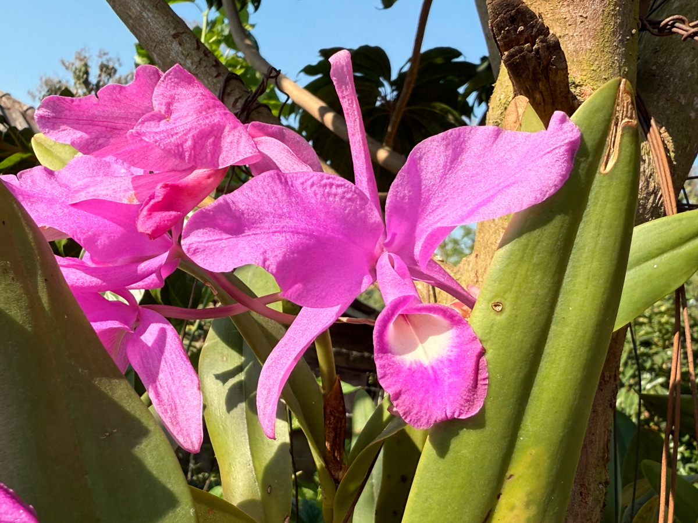</a>

<h2>家ではいつものチビちゃんが、登り坂チャレンジ！</h2>
<a href="20250124_004.JPG" target="_blank">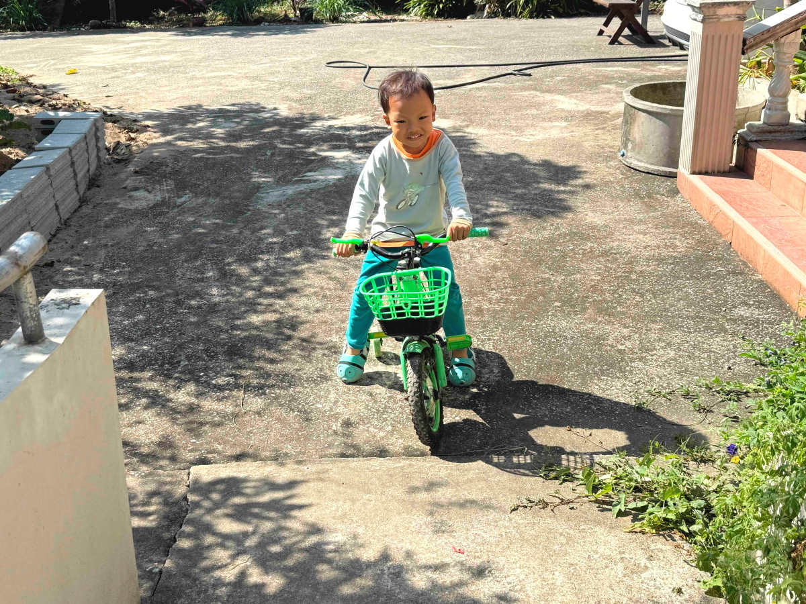</a>

<h2>かなりスピード感も出てきました</h2>
<a href="20250124_005.JPG" target="_blank">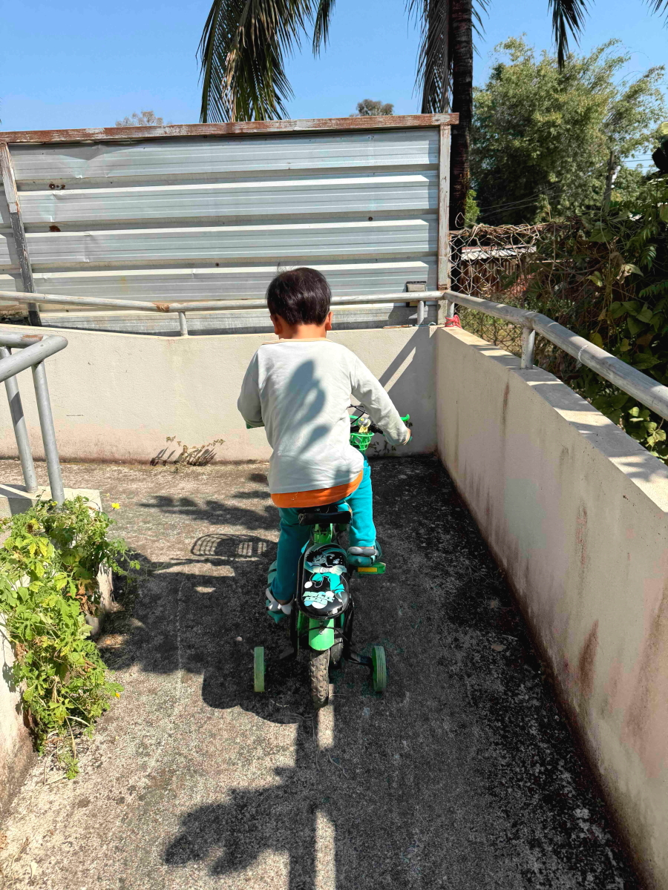</a>

<h2>ご近所の昔ながらの高床式住居、 ブロック塀で下の部分が見えませんが、柱だけです</h2>
<a href="20250124_006.JPG" target="_blank">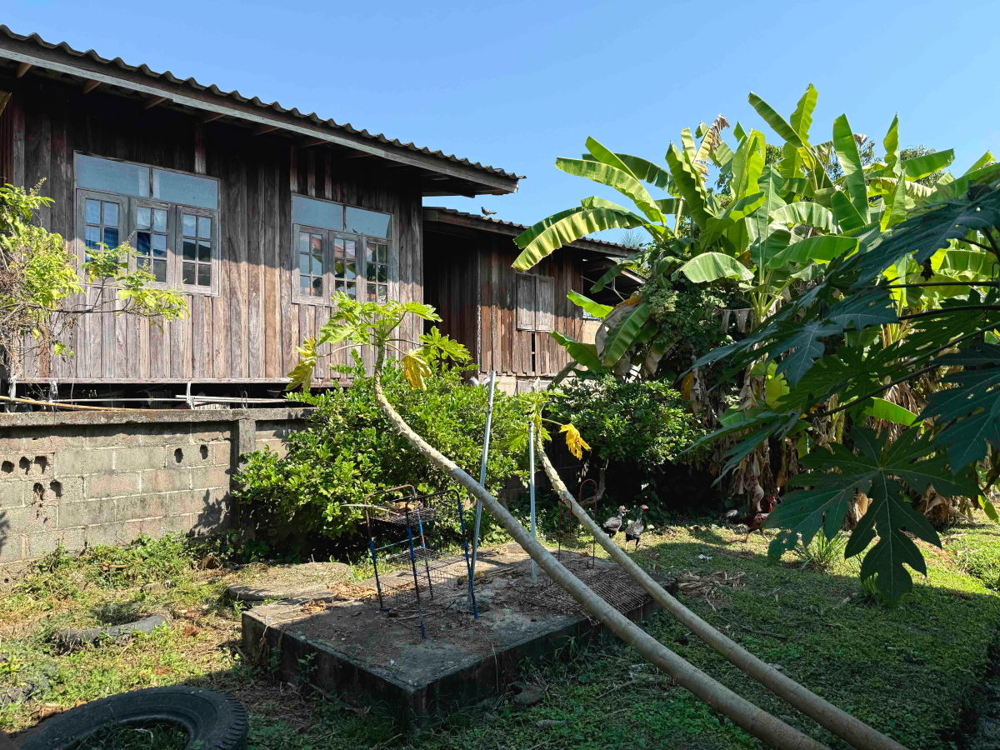</a>

<h2>夕方はいつもの水撒きで、虹作り</h2>

<h2>アヒル一家はいつものお散歩</h2>
<a href="20250124_008.JPG" target="_blank">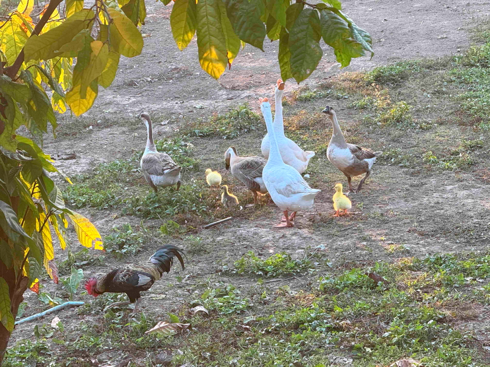</a>

<h2>ニワトリのめんどりも、ひな20羽の子育て中</h2>
<a href="20250124_009.JPG" target="_blank">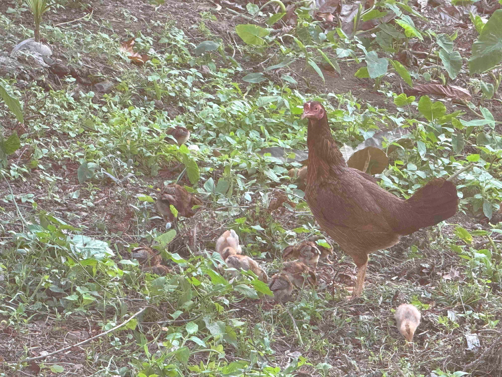</a>

<h2>ネズミやトカゲには容赦無い猫ちゃんも 新しい命には敬意を表して見守りモード 画像クリックで動画再生します ↓</h2>

<h2>塀の上では猫が夕陽を眺めます</h2>
<a href="20250124_010.JPG" target="_blank">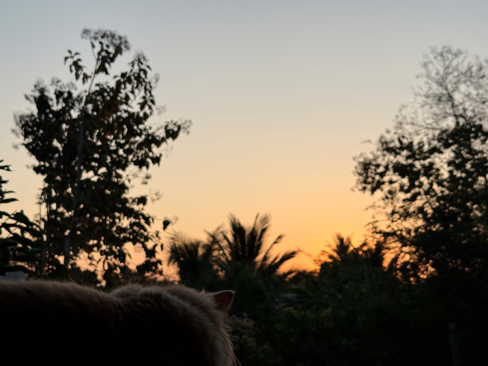</a>

<h2>猫目線の夕焼け</h2>
<a href="20250124_011.JPG" target="_blank">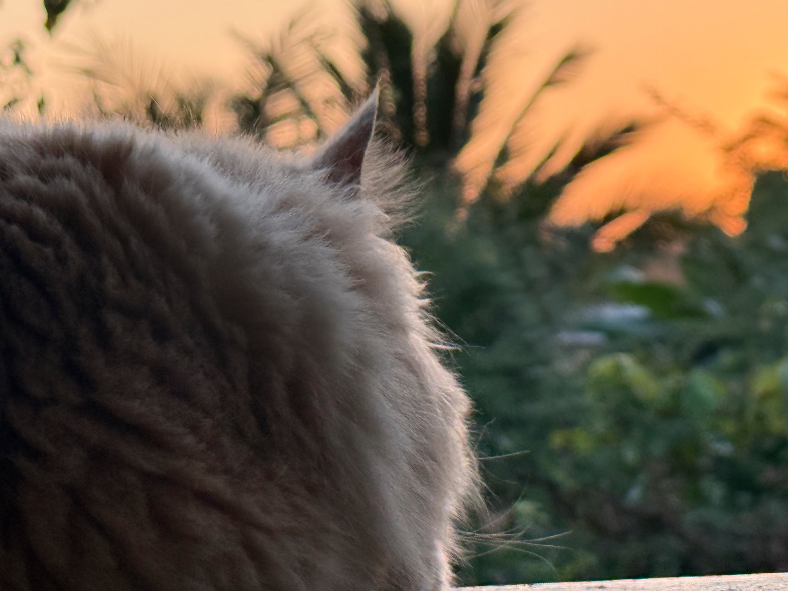</a>

<h2>暗くなると、鶏一家は小屋に戻ります</h2>
<a href="20250124_012.JPG" target="_blank">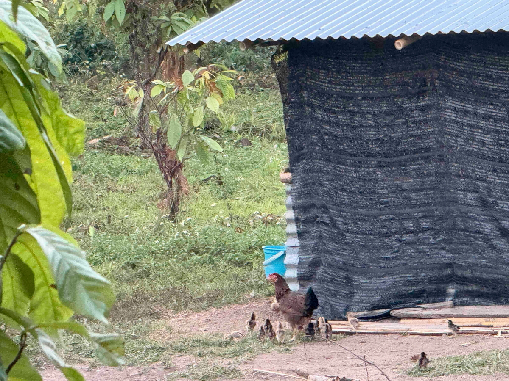</a>

<h2>夕暮れが始まりました</h2>

<h2>まだ明るいので地上も見えてます。 右奥が先ほどの鶏小屋</h2>
<a href="20250124_015.JPG" target="_blank">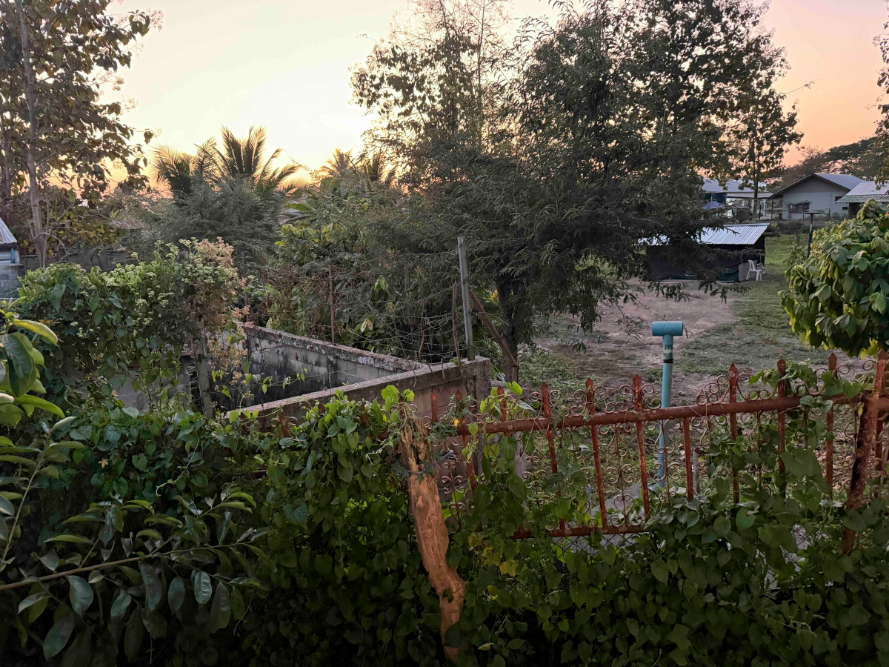</a>

<h2>今日の夕焼けグラデーションはピンク掛かってました</h2>

<h2>ピンクは一瞬で、すぐに宵の明星「金星」が輝きました</h2>

<h2>夕焼け空のBGMは、ちょっと元気にWestlife</h2>
<iframe width="560" height="315" src="https://www.youtube.com/embed/jz-eEtT3asE?si=CNsjXkGyEdOb3mLZ" title="YouTube video player" frameborder="0" allow="accelerometer; autoplay; clipboard-write; encrypted-media; gyroscope; picture-in-picture; web-share" referrerpolicy="strict-origin-when-cross-origin" allowfullscreen></iframe> 

   
<h2>以上、ちょっと細くなった朝のお月様からスタート。 故人をダビに付して散骨も終了、最後は何度見ても見飽きない夕焼けグラデーションでした。 ここまで観ていただきありがとうございました。</h2>

     
<h2>
<a href="https://torokoid.github.io/20241126_chiangrai/" target="_blank">Back to the menu page</a>
</h2>

   

         

  

      

<!--本体はここまで-->

<!--画面に空白地帯を作って、背景が見えるようにしています-->
                                              

<!-- フッタ -->
<footer>

Copyright 2025/01/24 alis @ChiangRai

</footer>

<!--HPにさまざまなJavaScriptを呼び込むための書式-->

